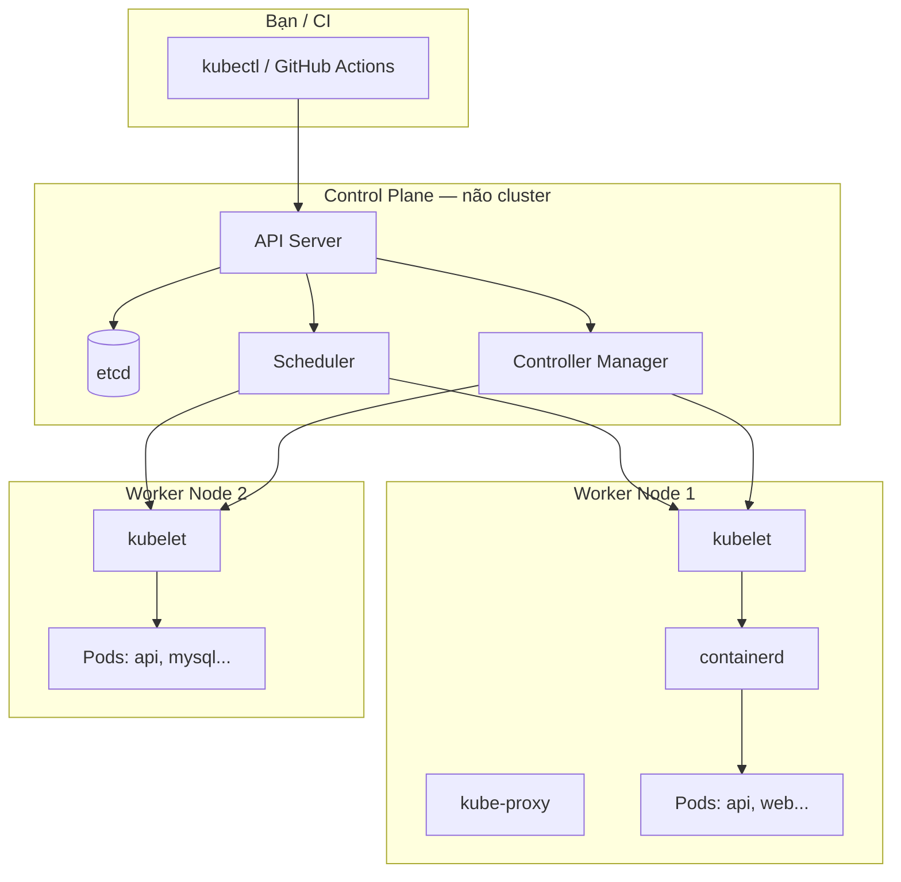

# Kubernetes — Giải thích các thành phần (học thật)

Tài liệu này giải thích **từng thành phần Kubernetes** theo cách dễ học, có liên hệ trực tiếp với project **findsource** trên domain `emiu.site` và các file trong `deploy/k8s/`.

Đọc song song với:
- [`README.md`](./README.md) — lộ trình triển khai 6 tuần
- [`base/`](./base/) — manifest thật (api, web, admin, mysql, ingress)

---

## 1. Kubernetes là gì?

Kubernetes (K8s) là **hệ điều hành cho cluster máy chủ**: bạn khai báo *“tôi muốn 2 bản API, 2 bản web, 1 MySQL”* — K8s lo việc **chạy, giám sát, tự sửa, cập nhật không downtime** trên nhiều server.

So với Docker Compose trên 1 máy:

| Docker Compose | Kubernetes |
|----------------|------------|
| `docker compose up` trên 1 server | Cluster nhiều node |
| Container | **Pod** (đơn vị nhỏ nhất) |
| `ports:` map cổng host | **Service** + **Ingress** |
| `.env` file | **Secret** / **ConfigMap** |
| `volumes:` local | **PersistentVolumeClaim** |
| Restart thủ công | **Deployment** tự tạo lại Pod |

---

## 2. Bức tranh tổng thể



**Luồng khi deploy findsource:**

```
kubectl apply -k overlays/production
    → API Server lưu desired state vào etcd
    → Scheduler: "Pod api replica 2 chạy trên worker nào?"
    → Controller Manager: đảm bảo đủ 2 Pod api, 2 Pod web...
    → kubelet trên từng worker: pull image, tạo Pod
    → containerd: chạy container findsource-api, findsource-web...
```

---

## 3. Control Plane (Master) — não cluster

Control Plane **không phải** nơi app “chạy” theo mô hình chuẩn (thường có **taint** `NoSchedule`), nhưng **điều khiển toàn bộ cluster**.

### 3.1 API Server

| | |
|---|---|
| **Là gì** | Cổng vào duy nhất của cluster — nhận mọi lệnh REST |
| **Ai gọi** | `kubectl`, GitHub Actions, dashboard, các controller |
| **Ví dụ** | `kubectl get pods -n findsource` → API Server trả danh sách Pod |

Mọi thứ bạn thấy trong `deploy/k8s/base/*.yaml` đều được gửi tới API Server khi `kubectl apply`.

### 3.2 etcd

| | |
|---|---|
| **Là gì** | Database key-value lưu **toàn bộ trạng thái cluster** |
| **Lưu gì** | Deployment, Pod, Secret, Service, node list, v.v. |
| **HA** | Production cần **số lẻ** node etcd: 3 hoặc 5 (quorum) |

Nếu mất etcd không backup → mất cấu hình cluster (app vẫn chạy tạm thời nhưng không quản lý được).

### 3.3 Scheduler

| | |
|---|---|
| **Là gì** | Quyết định **Pod mới chạy trên node nào** |
| **Xét** | CPU/RAM còn trống, affinity, taint/toleration, PVC zone |

Ví dụ: Pod `mysql-0` (StatefulSet) cần disk → Scheduler chọn node có **PersistentVolume** phù hợp.

### 3.4 Controller Manager

| | |
|---|---|
| **Là gì** | Chạy nhiều **controller loop** — liên tục so sánh *desired* vs *actual* |
| **Ví dụ** | Deployment controller: muốn 2 Pod api, đang có 1 → tạo thêm 1 |
| **Khác** | ReplicaSet, Node, Job, Endpoint controller... |

Đây là lý do K8s “tự heal”: Pod api crash → ReplicaSet/Deployment tạo Pod mới.

### 3.5 Cloud Controller Manager (tuỳ chọn)

Tích hợp cloud (AWS/GCP/Azure): tạo Load Balancer, gắn disk, route. VPS bare-metal (Viettel, VNCloud) thường **không dùng** — thay bằng MetalLB hoặc NodePort/Ingress.

---

## 4. Worker Node — nơi app thực sự chạy

### 4.1 kubelet

| | |
|---|---|
| **Là gì** | Agent trên **mỗi node** — nhận lệnh từ API Server |
| **Làm gì** | Tạo/xóa Pod, mount volume, chạy health probe |
| **Lệnh hay dùng** | `kubectl describe node`, `kubectl logs` (kubelet ghi log container) |

File `readinessProbe` / `livenessProbe` trong `base/api/deployment.yaml` — kubelet thực thi HTTP check tới `/process`.

### 4.2 kube-proxy

| | |
|---|---|
| **Là gì** | Quản lý **network rule** trên node |
| **Làm gì** | Cho phép Service `api:7003` load balance tới **mọi Pod** có label `app: api` |

Khi Ingress gửi traffic tới `Service api` → kube-proxy (hoặc dataplane hiện đại) phân phối tới Pod api-xxx và api-yyy.

### 4.3 Container Runtime

| | |
|---|---|
| **Là gì** | Phần mềm thực sự chạy container |
| **Phổ biến** | **containerd** (kubeadm mặc định), CRI-O |
| **Không phải** | Docker Engine trực tiếp (K8s ≥ 1.24 bỏ dockershim) |

Image `ghcr.io/.../findsource-api:production` được kubelet yêu cầu containerd pull và chạy.

---

## 5. Workload — đơn vị ứng dụng

### 5.1 Pod

| | |
|---|---|
| **Là gì** | **Đơn vị nhỏ nhất** — 1 hoặc nhiều container **cùng network, cùng volume** |
| **Vòng đời** | Ephemeral — bị xóa thì **không** tự quay lại (trừ khi có controller) |
| **Findsource** | 1 Pod api = 1 container NestJS port 7003 |

```bash
kubectl get pods -n findsource
kubectl logs -n findsource deployment/api -f
kubectl exec -it -n findsource deployment/api -- sh
```

**Không** deploy Pod trực tiếp trong production — dùng Deployment/StatefulSet.

### 5.2 ReplicaSet

| | |
|---|---|
| **Là gì** | Giữ **N Pod** cùng label |
| **Thực tế** | Bạn hiếm khi tạo tay — **Deployment** quản lý ReplicaSet |

`spec.replicas: 2` trong Deployment api → ReplicaSet đảm bảo luôn có 2 Pod.

### 5.3 Deployment

| | |
|---|---|
| **Là gì** | Khai báo app **stateless**, rolling update, scale |
| **Findsource** | `api`, `web`, `admin` trong `base/*/deployment.yaml` |
| **Rolling update** | `maxUnavailable: 0` — không downtime khi deploy image mới |

```yaml
# Trích base/api/deployment.yaml
spec:
  replicas: 2
  strategy:
    type: RollingUpdate
```

**Học thực hành:**
```bash
kubectl rollout status deployment/api -n findsource
kubectl rollout history deployment/api -n findsource
kubectl rollout undo deployment/api -n findsource
```

### 5.4 StatefulSet

| | |
|---|---|
| **Là gì** | Pod **có identity cố định** (mysql-0, mysql-1), disk gắn theo Pod |
| **Dùng khi** | Database, queue có state, cần tên host ổn định |
| **Findsource** | `base/mysql/statefulset.yaml` |

Khác Deployment:
- Tên Pod: `mysql-0`, không random
- **volumeClaimTemplates** — mỗi Pod 1 PVC riêng
- Service thường **Headless** (`clusterIP: None`) — DNS `mysql-0.mysql.findsource.svc`

API connect `DB_HOST=mysql` → Service trỏ tới Pod mysql-0.

### 5.5 DaemonSet

Chạy **1 Pod trên mọi node** (hoặc node được chọn). Ví dụ: node exporter, fluentd, CNI plugin. Findsource không dùng trực tiếp.

### 5.6 Job / CronJob

Chạy task **một lần** hoặc **theo lịch**. Ví dụ: backup MySQL hàng ngày (`scripts/07-backup-mysql.sh` có thể chuyển thành CronJob).

---

## 6. Networking

### 6.1 Service

| | |
|---|---|
| **Là gì** | **IP/DNS ổn định** trỏ tới tập Pod (load balance) |
| **ClusterIP** | Chỉ truy cập **trong cluster** (mặc định) |
| **NodePort** | Mở port trên mọi node |
| **LoadBalancer** | Cloud LB (hoặc MetalLB trên bare-metal) |

Findsource:

| Service | Port | Pod |
|---------|------|-----|
| `api` | 7003 | findsource-api |
| `web` | 80 | nginx + static FE |
| `admin` | 80 | nginx + static admin |
| `mysql` | 3306 | mysql-0 |

Trong cluster: `http://api.findsource.svc.cluster.local:7003`

### 6.2 Ingress

| | |
|---|---|
| **Là gì** | **HTTP/HTTPS routing** theo domain/path từ ngoài internet |
| **Cần** | **Ingress Controller** (nginx, traefik...) |
| **Findsource** | `base/ingress/ingress.yaml` |

```
be.emiu.site      → Service api:7003
emiu.site         → Service web:80
admin.emiu.site   → Service admin:80
```

**Ingress ≠ SSL.** SSL do **cert-manager** + **ClusterIssuer** (Let's Encrypt) — file `base/cert-manager/cluster-issuer.yaml`.

### 6.3 DNS trong cluster

CoreDNS (cài sẵn sau kubeadm + CNI):
- `api.findsource.svc` → Service api
- `mysql.findsource.svc` → Service mysql

---

## 7. Storage — lưu dữ liệu bền

### 7.1 PersistentVolume (PV)

Khối storage **thật** trên cluster (disk node, NFS, cloud disk).

### 7.2 PersistentVolumeClaim (PVC)

| | |
|---|---|
| **Là gì** | App **xin** dung lượng — K8s bind PV phù hợp |
| **Findsource** | `api-uploads` (10Gi) — file upload API |
| **MySQL** | `mysql-data` qua volumeClaimTemplates (20Gi) |

```yaml
# api/deployment.yaml
volumeMounts:
  - mountPath: /app/office-storage
    name: uploads
```

**ReadWriteOnce (RWO):** 1 node ghi tại một thời điểm — Pod api replica 2 **cùng mount 1 PVC** có thể lỗi trên multi-node. Production sau này nên: 1 replica api + PVC, hoặc dùng S3/MinIO cho upload.

### 7.3 StorageClass

Định nghĩa “loại disk” (local-path, gp3 AWS, v.v.). kubeadm thường dùng provisioner của cloud hoặc local-path.

---

## 8. Cấu hình & bí mật

### 8.1 ConfigMap

Dữ liệu **không nhạy cảm** dạng key-value (config file, feature flag). Có thể mount vào Pod hoặc env.

### 8.2 Secret

| | |
|---|---|
| **Là gì** | Password, JWT, token — **base64** (không phải mã hóa mạnh) |
| **Findsource** | `findsource-api-env`, `findsource-mysql-env` — tạo bởi `scripts/05-create-secrets.sh` |
| **Pull image** | `ghcr-secret` — đăng nhập GHCR |

```bash
kubectl get secret -n findsource
kubectl describe secret findsource-api-env -n findsource
```

Production nên thêm: **Sealed Secrets**, **External Secrets**, hoặc Vault.

---

## 9. Namespace

| | |
|---|---|
| **Là gì** | **Không gian tên logic** — cách ly resource |
| **Findsource** | Namespace `findsource` — mọi app trong `base/namespace.yaml` |

```bash
kubectl get all -n findsource
kubectl get all -n ingress-nginx
kubectl get all -n cert-manager
```

---

## 10. Addons trong project findsource

| Thành phần | Vai trò | Cài bằng |
|------------|---------|----------|
| **ingress-nginx** | Ingress Controller | `scripts/04-install-addons.sh` |
| **cert-manager** | Tự cấp TLS Let's Encrypt | Helm + ClusterIssuer |
| **Helm** | Package manager cho K8s | script 04 |

cert-manager tạo **Certificate** CR → ACME HTTP-01 qua Ingress → Secret `findsource-tls`.

---

## 11. kubectl — công cụ bạn dùng hàng ngày

| Lệnh | Ý nghĩa |
|------|---------|
| `kubectl apply -f ...` | Gửi manifest → API Server |
| `kubectl get pods,svc,ingress -n findsource` | Xem resource |
| `kubectl describe pod <name>` | Debug: event, probe fail, OOM |
| `kubectl logs deployment/api -f` | Xem log |
| `kubectl exec -it ... -- sh` | Vào trong container |
| `kubectl port-forward svc/api 7003:7003` | Truy cập local không qua Ingress |
| `kubectl top nodes/pods` | CPU/RAM (cần metrics-server) |

**Thứ tự debug khi site lỗi:**
1. `kubectl get pods -n findsource` — Pod Running?
2. `kubectl describe pod ...` — ImagePullBackOff? CrashLoopBackOff?
3. `kubectl logs ...` — lỗi app?
4. `kubectl get ingress,certificate -n findsource` — SSL OK?
5. `curl https://be.emiu.site/process` — từ ngoài

---

## 12. Topology cluster findsource (kubeadm)

```
cp-1:        API Server, etcd, Scheduler, Controller Manager (taint — app không chạy)
worker-1/2:  kubelet, kube-proxy, containerd → Pods findsource
```

Cài: [`kubeadm/README.md`](./kubeadm/README.md)

**Sau này nâng HA:** 3 Control Plane + Load Balancer — phase nâng cao, không làm tuần đầu.

---

## 13. Map manifest findsource → khái niệm

| File | Kind | Học gì |
|------|------|--------|
| `namespace.yaml` | Namespace | Cách ly project |
| `mysql/statefulset.yaml` | StatefulSet + Service + PVC | Database có state |
| `api/deployment.yaml` | Deployment + Service + PVC | App stateless, scale, probe |
| `web/deployment.yaml` | Deployment + Service | Static site, scale |
| `admin/deployment.yaml` | Deployment + Service | Admin panel |
| `ingress/ingress.yaml` | Ingress | Domain emiu.site |
| `cert-manager/cluster-issuer.yaml` | ClusterIssuer | SSL tự động |
| `overlays/production/kustomization.yaml` | Kustomize | Image tag, overlay prod |

---

## 14. Lộ trình học từng thành phần (gợi ý)

| Tuần | Thành phần | Thực hành trên findsource |
|------|------------|---------------------------|
| 1 | Pod, Node, kubectl | `get pods`, `logs`, `exec` |
| 2 | Deployment, ReplicaSet, rolling update | Scale api `replicas: 3`, rollout undo |
| 3 | Service, Ingress, DNS | `curl` qua Service trong cluster |
| 4 | Secret, ConfigMap | Sửa JWT secret, restart Pod |
| 5 | StatefulSet, PVC | Backup/restore MySQL |
| 6 | cert-manager, CI/CD | Push image → rollout |

---

## 15. Thuật ngữ nhanh

| Thuật ngữ | Một câu |
|-----------|---------|
| **Desired state** | Trạng thái bạn khai báo trong YAML |
| **Actual state** | Trạng thái thực tế trên cluster |
| **Reconcile** | Controller liên tục kéo actual → desired |
| **Label / Selector** | Gắn nhãn Pod, Service dùng nhãn để route |
| **Taint / Toleration** | Node “đuổi” Pod; Pod “chấp nhận” vào node |
| **Affinity** | Pod thích / ghét node nào |
| **Probe** | kubelet check Pod còn sống / sẵn sàng nhận traffic |
| **CRD** | Custom Resource — mở rộng K8s (Certificate của cert-manager) |

---

## 16. Đọc thêm (chính thống)

- [Kubernetes Concepts](https://kubernetes.io/docs/concepts/) — tài liệu gốc
- [kubeadm](https://kubernetes.io/docs/setup/production-environment/tools/kubeadm/) — cài cluster production
- [ingress-nginx](https://kubernetes.github.io/ingress-nginx/)
- [cert-manager](https://cert-manager.io/docs/)

---

**Tiếp theo:** Sau khi đọc xong, mở [`README.md`](./README.md) Tuần 1 và bắt đầu dựng cluster — mỗi lệnh `kubectl` sẽ map lại đúng một thành phần trong file này.
